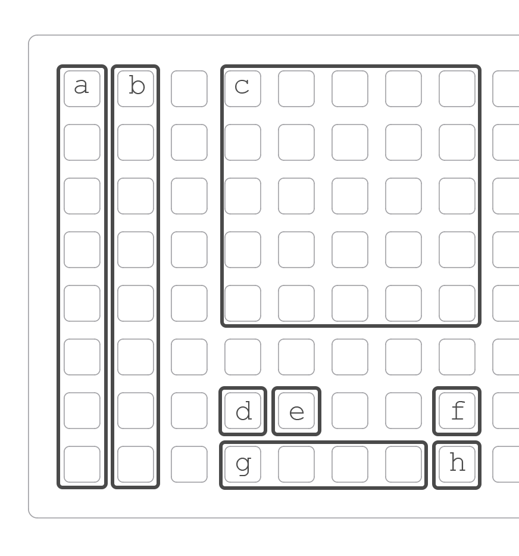

# foulplay

a euclidean instrument with trigger conditions.
based on tehn/playfair.

samples can be loaded via PARAMETERS in the main menu.

---
---

## home

when first starting foulplay you will be greeted with 8 tracks for euclidean rhythms. this is **home**. 

while **home**, KEY3 is ALT.

- ENC1 selects which track to focus.
- ENC2 sets the number of hits.
- ENC3 sets the track length.
- KEY2 starts and stops the clock.

- ALT + ENC1 sets the mix volume level.
- ALT + ENC2 sets the track rotation value.
- ALT + ENC3 sets the track bpm.
- ALT + KEY2 is track reset.
---

## track edit

each track can be configured to either send midi or trigger a sample.
please see the PARAMETERS menu for configuration.

holding KEY1 will bring up the **track edit** screen, releasing KEY1 will return **home**.
 
**track edit** is where you will find trigger conditions and probability settings, as well as various sample specific parameters. 
if sending midi, **track edit** will contain shortcuts for setting the midi channel and note.

in **track edit** parameters 1-3 are tied to their respective encoders.

- KEY2 advances to the next track.
- KEY3 advances to the next **track edit** page. 

---

# grid 
(coded by @junklight)



* a. track select column
* b. track mute toggle column
* c. pattern and pset select area
* d. start / stop button
* e. phase reset button
* f. pset load button
* g. track edit pages
* h. copy button

pressing a button in section **a** will select which track to focus for editing. tracks are numbered top to bottom, 1-8.

pressing a button in section **b** will mute or unmute the adjacent track in section **a**.

section **c** is a multi-function area containing 25 buttons numbered from left to right, top to bottom. if no modifiers are held, pressing a button in section **c** will load the corresponding pattern data.

pressing **d** will start or stop the clock.

pressing **e** will reset all tracks to 1.

**f** is a modifier button for section **c**. holding **f** and pressing in section **c** will load the corresponding pset data.

the buttons in section **g** open track edit pages for your currently selected track.

**h** is a modifier button for section **c**, allowing for copy/paste behavior. holding **h** and pressing a pattern in section **c** will copy the selected pattern. while still holding **h**, press the desired pattern location to paste.

---

### saving/ loading your work

to save your loaded samples and their settings, navigate to the ```PARAMETERS``` page and hold Norns Key1. turn Enc2 to select save, and Enc3 to scroll through available save slots. use Key3 to save your data to the slot.

pattern data, such as steps, fill, rotation, mute state, and logic settings are saved automatically every 10 seconds.
